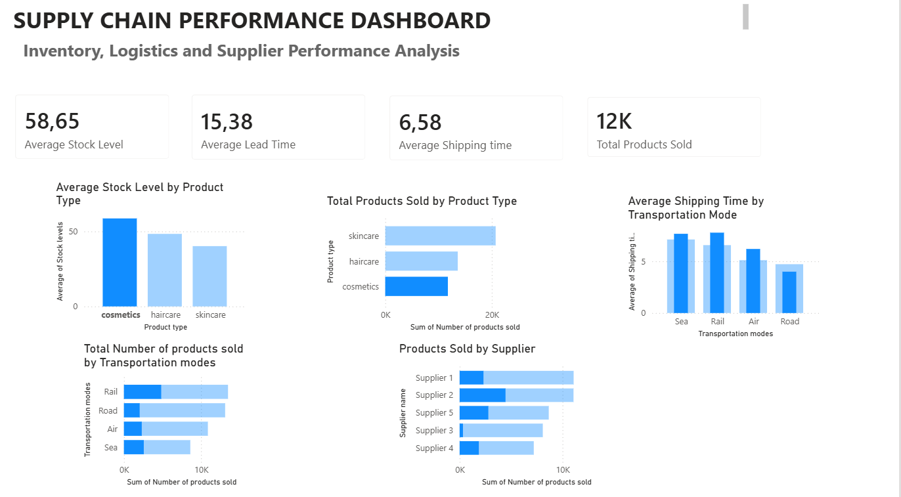

# Supply Chain Performance Dashboard

## Overview

This project presents an interactive Power BI dashboard designed to analyze key supply chain performance metrics. The dashboard provides insights into inventory management, product sales, supplier contribution, and transportation efficiency.

## Dashboard Preview

## Key Metrics

* Average Stock Level
* Average Lead Time
* Average Shipping Time
* Total Products Sold

## Analysis Included

### Product Performance

* Average Stock Level by Product Type
* Total Products Sold by Product Type

### Transportation Analysis

* Average Shipping Time by Transportation Mode
* Total Products Sold by Transportation Mode

### Supplier Analysis

* Products Sold by Supplier

