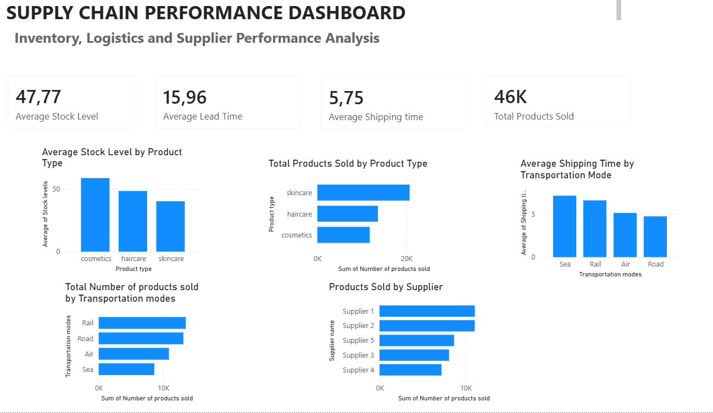

# Supply Chain Performance Dashboard

## Overview

This project presents an interactive Power BI dashboard developed to monitor inventory performance, supplier contribution, transportation efficiency, and product sales. The dashboard enables data-driven decision-making through KPI tracking and operational performance analysis.

## Dashboard Preview

## Key Metrics

* Average Stock Level
* Average Lead Time
* Average Shipping Time
* Total Products Sold

## Analysis Included

### Product Performance

* Average Stock Level by Product Type
* Total Products Sold by Product Type

### Transportation Analysis

* Average Shipping Time by Transportation Mode
* Total Products Sold by Transportation Mode

### Supplier Analysis

* Products Sold by Supplier

## Tools & Technologies

- Power BI
- Microsoft Excel
- Data Visualization
- Supply Chain Analytics
- Business Intelligence
- KPI Reporting

## Key Findings & Recommendations

### Key Findings

* Product categories showed different inventory levels and sales performance patterns.
* Transportation modes demonstrated varying shipping times, affecting operational efficiency.
* Supplier contribution to product sales was uneven, with several suppliers generating a larger share of overall sales.
* Lead time and inventory metrics highlighted opportunities to improve supply chain responsiveness.

### Recommendations

1. Optimize inventory allocation based on product demand and stock level performance.

2. Review transportation methods with higher shipping times and explore alternative logistics options to improve delivery performance.

3. Strengthen collaboration with top-performing suppliers while developing contingency plans for supply continuity.

4. Implement inventory monitoring and forecasting processes to reduce stock shortages and excess inventory.

5. Use KPI-based performance management to support continuous improvement across supply chain operations.

## Author

**Fatima-Ezzahra Lasfar**

